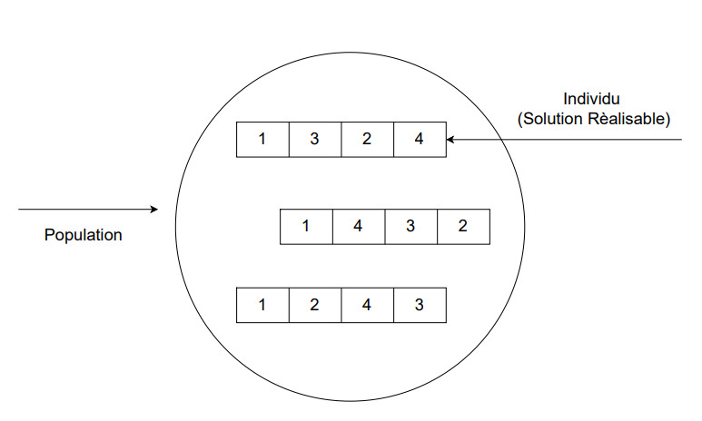

# VRP : Vehicle-Routing-Problem
Le VRP a été le sujet d’une recherche intensive durant plus de cinquante ans, liée à son importance
dans le domaine de la logistique, et à sa grande difficulté. Le VRP implique la planification de routes
de livraison à moindre cout, afin de servir un ensemble de clients dispersés géographiquement, tout
en respectant les contraintes de capacité des véhicule

Lorsque le VRP possède une seule fonction objectif, comme la minimisation du coût total, les mé-
thodes de résolution exactes telles que la programmation linéaire ou entière peuvent être employées
pour obtenir une solution optimale, garantissant la meilleure efficacité possible [8]. Pour les pro-
blèmes de grande taille, des méthodes heuristiques et métaheuristiques comme la recherche locale, les
algorithmes génétiques ou le recuit simulé peuvent être préférées pour trouver des solutions proches
de l’optimum global dans un temps raisonnable. dans notre cas on a opté pour le VRP avec une
seule fonction objectif

Le problème de tournées de véhicules est classé par la littérature parmi les problèmes de classe NP-difficile, c.-à-d. on ne peut pas obtenir la solution optimale dans un temps raisonnable surtout dans le cas où la taille du problème augmente, ce qui dirige vers la recherche d'une solution proche de l'optimale en utilisant des méthodes dites approchées

## CVRP :

Le problème de tournées de véhicules avec capacité (CVRP) est modélisé sous forme d’un graphe complet et non orienté $G=(C, A)$, où $V=\{C_0, C_1, ..., C_n\}$ est l’ensemble des sommets tels que C0 désigne le dépôt et C1,...,Cn représentent les clients. Chaque client a une demande non négative de marchandises. A est l’ensemble des arêtes, où chaque arête est associée au coût de déplacement entre deux clients. Une flotte de véhicules homogènes à capacité limitée est disponible pour servir les clients. L’objectif du problème CVRP est donc de minimiser la distance totale parcourue de telle sorte que :

1. chaque tournée doit commencer et se terminer au dépôt.
2. la charge totale de chaque tournée ne doit pas dépasser la capacité du véhicule
3. chaque client doit être desservi par un et un seul véhicule.

## Modèlisation : 
L’objectif du VRP est de minimiser le coût total, c-à-d la somme des distances ou des temps
de parcours des tournées, tout en respectant la contrainte de capacité des véhicules : la quantité de
marchandises livrées sur une tournée ne doit pas dépasser la capacité du véhicule qui l’assure

### Exemple :
la figure au dessous représente un exmeple de VRP avec 15 clients et 3 véhicules

  

## Methode de resolution : 

es fondements des algorithmes génétiques remontent aux années 1960, époque à laquelle John
Holland [7], avec ses collaborateurs et étudiants de l’Université du Michigan, a commencé à explorer
cette approche. Ils ont innové en introduisant les opérateurs de croisement et de mutation, des mé-
canismes clés qui facilitent la convergence vers une solution optimale d’une fonction donnée par la
combinaison des caractéristiques génétiques de divers individus au sein d’une population

Les algorithmes génétiques sont particulièrement utiles dans les situations où l’espace de recherche est vaste et complexe, et où les méthodes traditionnelles d’optimisation sont inefficaces ou trop lentes. Ils sont basés sur la création d’une population de solutions potentielles, l’évaluation de ces solutions selon une fonction de fitness, et l’utilisation de mécanismes tels que la sélection, le croisement et la mutation pour générer de nouvelles générations de solutions plus adaptées

### 1. Population : 
La population représente l'ensemble des solutions réalisables(individu), qu'est sélectionné au hasard lors de la première itération. Le choix de la population initiale d'individus conditionne fortement la rapidité de l'algorithme. La taille des populations est d'ordinaire fixée à l'avance, mais peut également varier d'une génération à l'autre.

  

### 2. Evaluation :

À cette étape, nous évaluons chaque solution en lui attribuant un score pour déterminer sa qualité. Ce processus nécessite un calcul rapide pour éviter de ralentir l'algorithme. Généralement, nous utilisons une fonction appelée "Fitness", qui correspond souvent à la fonction objectif visant à maximiser ou minimiser une certaine métrique.

### 3. Sèlection :

À cette étape, nous choisissons les candidats qui se reproduiront et s'entrecroiseront pour former la prochaine génération. Ce processus ressemble à la sélection naturelle, où les individus les mieux adaptés sont favorisés pour se reproduire, améliorant ainsi globalement l'adaptation de la population. Il existe différentes méthodes de sélection : 

1. Sélection par rang : Cette méthode conserve les meilleurs individus en fonction de leur score de fitness. Si une population compte N individus, les K meilleurs sont sélectionnés pour la reproduction.
2. Sélection par roulette : Aussi appelée "roue de la fortune", chaque individu a une probabilité de sélection proportionnelle à son adaptation au problème. On utilise une roue de la fortune biaisée pour sélectionner les individus, puis on procède à un tirage au sort homogène.
3. Sélection uniforme : Les individus sont sélectionnés de manière aléatoire, sans prendre en compte leur niveau d'adaptation. Chaque individu a une probabilité égale d'être choisi, soit 1/N où N est le nombre total d'individus dans la population.

### 4. Croissement :

Lors de cette étape, deux solutions  échangent des segments de leurs gènes pour produire de nouveaux solutions . Ces échanges peuvent être simples ou multiples. Dans le premier cas, les solutions échangent des segments en un seul point. Dans le second cas, plusieurs points d'échange sont impliqués.

### 5. Mutation :

De manière aléatoire, un gène  peut être remplacé par un autre. Comme pour les croisements, nous définissons un taux ou une probabilité, notée Pm, pour déterminer quand et comment cette mutation peut se produire lors des changements de population. Il est essentiel de choisir une valeur faible pour ce taux afin de ne pas entraîner une recherche aléatoire et de maintenir les principes de sélection et d'évalution. La mutation est appliquée pour éviter une convergence prématurée de l'algorithme, ce qui signifie qu'elle empêche la convergence vers un extremum local lors d'une recherche d'extrémum.

### 6. Critères d'arrèt :

La condition de terminaison d’un algorithme génétique est importante pour déterminer quand son exécution se termine. Nous voulons généralement une condition d’arrêter telle que notre solution soit proche de l’optimum, à la fin de l’exécution. Habituellement, nous gardons l’une des conditions d’arrêt suivantes : 
1. Lorsqu’un nombre spécifique d’itérations est atteint.
2. Lorsque la valeur de la fonction objective a atteint une certaine valeur prédéfinie.
3. Quand il n’y a pas eu d’amélioration de la population pendant X itérations, c’est-à-dire lorsque la variation de la valeur de performance des candidats par rapport aux générations précédentes est plus petite qu’un seuil choisi au préalable.

