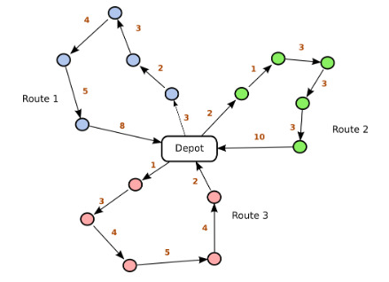

# VRP : Vehicle-Routing-Problem
Le VRP a été le sujet d’une recherche intensive durant plus de cinquante ans, liée à son importance
dans le domaine de la logistique, et à sa grande difficulté. Le VRP implique la planification de routes
de livraison à moindre cout, afin de servir un ensemble de clients dispersés géographiquement, tout
en respectant les contraintes de capacité des véhicule

Lorsque le VRP possède une seule fonction objectif, comme la minimisation du coût total, les mé-
thodes de résolution exactes telles que la programmation linéaire ou entière peuvent être employées
pour obtenir une solution optimale, garantissant la meilleure efficacité possible [8]. Pour les pro-
blèmes de grande taille, des méthodes heuristiques et métaheuristiques comme la recherche locale, les
algorithmes génétiques ou le recuit simulé peuvent être préférées pour trouver des solutions proches
de l’optimum global dans un temps raisonnable. dans notre cas on a opté pour le VRP avec une
seule fonction objectif

Le problème de tournées de véhicules est classé par la littérature parmi les problèmes de classe NP-difficile, c.-à-d. on ne peut pas obtenir la solution optimale dans un temps raisonnable surtout dans le cas où la taille du problème augmente, ce qui dirige vers la recherche d'une solution proche de l'optimale en utilisant des méthodes dites approchées

## CVRP :

Le problème de tournées de véhicules avec capacité (CVRP) est modélisé sous forme d’un graphe complet et non orienté $G=(C, A)$, où $V=\{C_0, C_1, ..., C_n\}$ est l’ensemble des sommets tels que C0 désigne le dépôt et C1,...,Cn représentent les clients. Chaque client a une demande non négative de marchandises. A est l’ensemble des arêtes, où chaque arête est associée au coût de déplacement entre deux clients. Une flotte de véhicules homogènes à capacité limitée est disponible pour servir les clients. L’objectif du problème CVRP est donc de minimiser la distance totale parcourue de telle sorte que :

1. chaque tournée doit commencer et se terminer au dépôt.
2. la charge totale de chaque tournée ne doit pas dépasser la capacité du véhicule
3. chaque client doit être desservi par un et un seul véhicule.

## Modèlisation : 
L’objectif du VRP est de minimiser le coût total, c-à-d la somme des distances ou des temps
de parcours des tournées, tout en respectant la contrainte de capacité des véhicules : la quantité de
marchandises livrées sur une tournée ne doit pas dépasser la capacité du véhicule qui l’assure

### Exemple :
la figure au dessous représente un exmeple de VRP avec 15 clients et 3 véhicules

  

{1\}}&space;d_{i}X_{ijk}&space;\leq&space;q_{k},&space;\quad&space;\forall&space;k&space;\in&space;K&space;\\&space;C_{ij}&space;\geq&space;0&space;,&space;\quad&space;d_{i}&space;\geq&space;0&space;,&space;\quad&space;q_{k}&space;\geq&space;0&space;,&space;\quad&space;X_{ijk}&space;\in&space;\{0,1\}&space;\end{align*})

<!DOCTYPE html>
<html lang="en">
<head>
  <meta charset="UTF-8">
  <meta name="viewport" content="width=device-width, initial-scale=1.0">
  <title>MathJax Test</title>
  
  
</head>
<body>

# My LaTeX Equations

Here are some LaTeX equations rendered using MathJax:

\[
\begin{align*}
& \textbf{PL} \quad \text{subject to:} \\
& \min(Z) = \sum_{i \in I} \sum_{j \in J} \sum_{k \in K} C_{ij} X_{ijk} \\
& \sum_{i \in I} \sum_{k \in K} X_{ijk} = 1, \quad \forall j \in I \setminus \{1\} \\
& \sum_{i \in I} X_{ijk} = \sum_{i \in I} X_{jik}, \quad \forall j \in I, \forall k \in K \\
& \sum_{j \in I \setminus \{1\}} X_{1jk} = 1, \quad \forall k \in K \\
& \sum_{i \in I} \sum_{j \in I \setminus \{1\}} d_{i}X_{ijk} \leq q_{k}, \quad \forall k \in K \\
& C_{ij} \geq 0 , \quad d_{i} \geq 0 , \quad q_{k} \geq 0 , \quad X_{ijk} \in \{0,1\}
\end{align*}
\]

</body>
</html>

